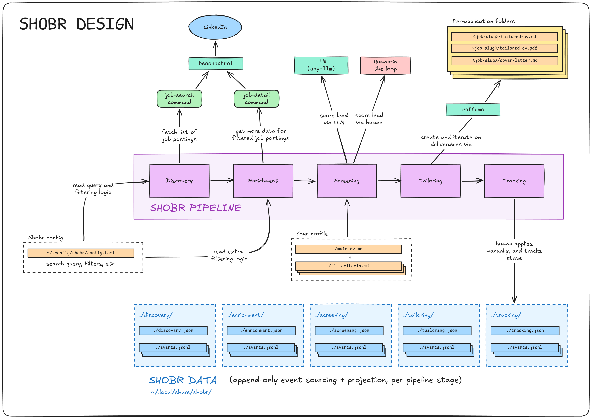

# SHOBR - Simulate Human Occupational-Bureaucratic Rituals

<p align="center">
  
</p>

**The stealthiest, UNIX-iest, ethical Job Search Automator, with a
Hacker-in-the-Loop approach.**


[](LICENSE)

## Introduction

In 2026's job market, there are many job application automation tools, some of
them FOSS. This one's mine, and relies on these tools:

- [`beachpatrol`](https://github.com/sebastiancarlos/beachpatrol) for browser
  automation of your _own daily-driver browser_, and
- [`roffume`](https://github.com/sebastiancarlos/roffume) for resume files
  management.



## Design Philosophy & Features

- **Daily-Driver Stealth:** We don't use headless browsers. SHOBR uses
  [`beachpatrol`](https://github.com/sebastiancarlos/beachpatrol) to drive
  your existing, authenticated browser. To LinkedIn, you are just a normal
  user clicking around.
- **Human-in-the-Loop:** SHOBR prepares, proposes, and verifies. It writes the
  drafts and builds the PDFs, but the final application submit is always done
  by you. This is _no "spray and pray"_, but you can still pray to any
  API-compatible deities.
- **Provider-Agnostic AI:** Uses one thin LLM abstraction. Run it on OpenAI,
  Anthropic, a local model, or hijack a local LLM agent subscription via
  [`faaah`](https://github.com/sebastiancarlos/faaah).
- **LLM-light By Design:** Quality semantic parsing requires some LLM, there's
  not much leeway around it. This project uses _as little LLM as possible_,
  and _doesn't demand an Agent driver_ (like other projects in this space). If
  you want more, it should be trivial to ask an LLM to write a SKILL or an MCP
  server on top of SHOBR.
- **Event-Sourced Data:** All data (discovered jobs, screenings, tracking) is
  saved in append-only JSONL event logs and projected into state files. You
  can interrupt the pipeline, or recompute lead approval with new rules, at
  any time without data loss.
- **Markdown-Based CV Toolchain:** Resumes are tailored in Markdown and
  compiled to ATS-readable PDFs (via Groff and Pandoc). All deliverables are
  put in per-application folders.
- **Full E2E Red-Green TDD:** Built with the stdlib's `unittest`, no extra
  framework.
- **Not Vibecoded**: 3500 LOC (including comments) at time of writing.
  Somewhat atypical in this space.

## Installation

### `beachpatrol` Requirement

The **one hard requirement** of this project is
[**`beachpatrol`**](https://github.com/sebastiancarlos/beachpatrol). You can
think of it as a browser that you're meant to use as your daily driver, but
which is _also_ fully automatable (via a clever "Playwright wrapper"
approach).

Why `beachpatrol`? Well, job search requires scraping. Ideally scraping done
using your _actual authenticated credentials_. So, what better way to avoid
detection than using your _actual daily-driver browser to do the scraping_?
(It should be virtually identical to regular use, provided you don't break any
ToS).

Other "job search automation tools" either use unauthenticated requests or
headless browsers, or ask you to extract / copy your authenticated credentials
into their automated browsers. Our `beachpatrol` approach aims to do them all
one better by _using your actual daily-driver browser_.

If you're interested, see [beachpatrol's
README](https://github.com/sebastiancarlos/beachpatrol).

### Installation Instructions

With `beachpatrol` already setup, `shobr` requires Python >= 3.14 with
[`uv`](https://docs.astral.sh/uv/):

```sh
git clone https://github.com/sebastiancarlos/shobr
cd shobr
uv sync               # install the single runtime dependency, `any-llm-sdk[openai]`
uv tool install .     # Put the `shobr` CLI on `PATH`
shobr --help
```

Because SHOBR leverages `roffume` to compile Markdown resumes into PDFs, you
will need some standard Unix text-processing tools on your system: `groff` and
`pandoc`.

Then, in order:

1. Run `shobr setup` to scaffold the SHOBR config file under
   `$XDG_CONFIG_HOME/shobr/config.toml`, the profile templates, and to make
   `shobr`'s own `beachpatrol` commands available to `beachpatrol` (by
   symlinking them into the expected folder). Fill the config in.
2. Ensure you have one `beachpatrol` profile which is logged into LinkedIn.
   Put that _`beachpatrol` profile name_ in `config.toml` on the
   `beachpatrol_profile` key.
3. For the parts of SHOBR requiring LLMs, `any-llm-sdk` reads provider keys
   from env (`OPENAI_API_KEY`, `SHOBR_AI_MODEL`, and `OPENAI_BASE_URL`).
   Naturally, you can use any LLM API provider you want through `any-llm-sdk`
   (or even hijack a locally available LLM agent subscription by using
   [`faaah`](https://github.com/sebastiancarlos/faaah)).
4. For the parts of SHOBR requiring to read your **main CV**, you can refer
   to it via the env `SHOBR_MAIN_CV_PATH` (or see next step).
5. For the parts of SHOBR requiring authoring CVs and application
   directories, you need to configure a **CV toolchain.**
    - The first time you reach the `tailor` step, `shobr` will offer to clone
     the latest [`roffume`](https://github.com/sebastiancarlos/roffume)
     release into `~/shobr-resumes` (or point `cv_toolchain_dir` in
     `config.toml` at an existing checkout). This folder will keep track of
     all your resume variation inputs (markdown) and outputs (PDFs).
   - Then, the _main CV_ defaults to `<cv_toolchain_dir>/resume.md`
     (`SHOBR_MAIN_CV_PATH` overrides).

## SHOBR Pipeline & CLI Commands

SHOBR breaks the job search process into _5 pipeline stages_.

You can run:

- **`shobr status`**
  - See details about every pipeline stage.
- **`shobr next`**
  - Have SHOBR automatically prompt you for the next logical action across the
    entire pipeline (rather than running the manual, "plumbing" command
    directly).

**Example `shobr status` output:**

```bash
$ shobr status

- DISCOVERY
  - Total Leads Found:     59
  - Rejected by Filter:    10
  - Pending Enrichment:    3

- ENRICHMENT
  - Total Enriched:        48
  - Rejected by Filter:    2
  - Pending Screening:     24

- SCREENING
  - Total Screened:        45
  - Skipped:               6
  - Lacking LLM Review:    1
  - Pending Human Review:  23
  - LLM Scores:    Human Scores:
    5: 11          5: 2 (1 to tailor)
    4: 9           4: 6 (5 to tailor)
    3: 9           3: 4 (4 to tailor)
    2: 8           2: 4 (4 to tailor)
    1: 8           1: 6
  - Pending Tailoring:     14

- TAILORING
  - Packages Built:        2
  - Pending Review:        0

- TRACKING
  - Applied:               2
  - Interviewing:          0
  - Offer:                 0
  - Rejected:              0
  - Ghosted:               0
  - Withdrawn:             0
```

### 1. Discovery

Scrapes the LinkedIn job search results based on your `config.toml` keywords
and locations, running them through a basic regex pre-filter.

- **`shobr discovered`**
  - Prints the stored leads summary without fetching.
- **`shobr discover`**
  - Triggers `beachpatrol` to search and scrape leads.

### 2. Enrichment

Visits individual job pages to extract full descriptions, salary ranges, and
Easy Apply links. Done one at a time to pace requests and avoid rate-limits.

- **`shobr enriched`**
  - Prints all enriched jobs.
- **`shobr enrich-next`**
  - Fetches the detail page for the oldest non-enriched lead.
- **`shobr enrich <posting_id>`**
  - Fetches a specific job.

### 3. Screening

Scores enriched jobs against your personal Markdown profile and deal-breakers.

- **`shobr screen-llm-next`**
  - Asks the LLM to score the next lead (1-5) and write reasoning.
- **`shobr screen-llm-all`**
  - Batch runs the LLM against all unscored leads.
- **`shobr screen-next`**
  - Records your own verdict for the next lead (score 1-5 plus reason),
    via `$EDITOR` or `--score`/`--reason`.

### 4. Tailoring

For jobs marked "Pursue", SHOBR uses the LLM to rewrite your base `resume.md`
to highlight relevant skills. It then uses the `roffume` (Groff/Pandoc)
toolchain to ensure the rewrite perfectly fits on one page, looping rewrites
if it overflows.

- **`shobr tailor-next`**
  - Builds the application package (Resume + Cover Letter) for the next
    pursue-able job.
- **`shobr tailored`**
  - Prints all generated packages.

### 5. Tracking

Local Kanban-style tracking for your applications.

- **`shobr track <posting_id> <status> [--note TEXT]`**
  - Updates pipeline status (`applied`, `interviewing`, `offer`, `rejected`,
    etc.).
- **`shobr tracked`**
  - Prints a high-level overview of your entire funnel.

## Configuration

Everything SHOBR knows about _you_ lives under
`$XDG_CONFIG_HOME/shobr/` (default `~/.config/shobr`): one `config.toml` plus
a `profile/*.md` folder. `shobr setup` scaffolds all of them with
instructional templates.

```text
config.toml      # filter rules, geo map, toolchain + browser wiring
profile/
  user-detail.md fit-criteria.md deal-breakers.md   # screen-llm inputs
  resume-guide.md cover-guide.md                    # tailor-only inputs
```

### [`config.toml`](src/shobr/templates/config.toml)

#### `cv_toolchain_dir` (required)

```toml
cv_toolchain_dir = "~/shobr-resumes"
```

Home of the _CV toolchain_ (a `roffume` git checkout). The _main resume_
defaults to `<cv_toolchain_dir>/resume.md`. The _CV toolchain_ directory will
ultimately contain all the generated CVs and other data, in its internal
"per-application" directories.

#### `beachpatrol_profile` (required)

```toml
beachpatrol_profile = "job-hunter"
```

`beachpatrol` browser profile holding the logged-in LinkedIn session.

#### `beachpatrol_browser` (default `"chromium"`)

```toml
beachpatrol_browser = "chromium"
```

`beachpatrol` browser to drive.

#### `titles` (required, list of strings)

```toml
titles = ["Technical Lead", "Software Engineer", "Senior Software Engineer"]
```

Job titles fed to LinkedIn search as one ORed keyword query. Like
"Software Engineer", "Fullstack Developer", etc.

#### `workplace_types` (optional, list of strings)

```toml
workplace_types = ["on-site", "hybrid", "remote"]
```

Appended to the same search OR query. Possible values are: `on-site`,
`hybrid`, `remote`.

#### `geo` (optional list of strings)

```toml
geo = ["new-york-city", "san-francisco-bay-area"]
```

Geo targets for the query, referred to BY NAME through the `[geo_ids]` map.

#### `[geo_ids]` (optional table, name = digits-only id)

```toml
[geo_ids]
new-york-city = "111111111"
san-francisco-bay-area = "222222222"
```

Maps each geo name to a LinkedIn geoId. The names are totally customizable,
but should represent the name of a real-world location. You have to obtain
the id directly from the LinkedIn Jobs URLs (`geoId=`), after performing a
search for a given location. Note that LinkedIn often has several ids per
place (city vs metro area).

#### `reject_employment_type` (optional list, can be empty)

```toml
reject_employment_type = ["Internship"]
```

Employment types rejected at enrichment. Possible values are: `Full-time`,
`Part-time`, `Contract`, `Temporary`, `Internship`.

#### `presence_locations` (optional list, can be empty)

```toml
presence_locations = ["New York"]
```

Places acceptable for presence-required work. Values are literal strings of
names of locations (matched case-insensitive). Remote postings pass anywhere.
"On-site" and "hybrid" postings must name a listed location.

#### `[reject_title]` (optional table, label = Python regex)

```toml
[reject_title]
golang = "\\bgolang\\b"
devops = "\\bdevops\\b"
```

Filters by pre-filter. Matched against job title. The leads are rejected with
reason `title contains '<label>'`.

### `profile/*.md` and the Main CV

The LLM stages read your profile as plain markdown files. Initialize the
profile templates with `shobr setup`, and then fill the files yourself.

#### The main CV

Your main CV, used as a base to generate tailored CVs. Referred by either
`SHOBR_MAIN_CV_PATH` or `<cv_toolchain_dir>/resume.md`.

#### [`profile/user-detail.md`](src/shobr/templates/profile-user-detail.md)

Work history and proficiencies in more detail than the CV.

#### [`profile/fit-criteria.md`](src/shobr/templates/profile-fit-criteria.md)

What makes a lead worth pursuing, in your own words.

#### [`profile/deal-breakers.md`](src/shobr/templates/profile-deal-breakers.md)

Veto rules (if found to match, it produces a score of `1`, meaning that the
lead is discarded).

#### [`profile/resume-guide.md`](src/shobr/templates/profile-resume-guide.md)

Your own rules and suggestions on how to tailor your main CV to a particular
application. It might include formatting rules.

#### [`profile/cover-guide.md`](src/shobr/templates/profile-cover-guide.md)

Guide about how to write the cover letter for a given application. Explain
tone, length, etc.

## The CV Toolchain

SHOBR relies on [`roffume`](https://github.com/sebastiancarlos/roffume), a
CV toolchain. The first `tailor` run offers to clone it (clones a pinned
release) into `~/shobr-resumes`.

`roffume` isn't hardwired. SHOBR talks to it through a **CV toolchain
interface** (four methods: `scaffold`, `build`, `page_check`, `finalize`)
defined by the `CvToolchain` abstract class in `cv_toolchain.py`. Any tool
that implements that interface can be swapped in for `roffume` (via some soft
forking-and-hacking).

```text
<cv_toolchain_dir>/        # default: ~/shobr-resumes
  resume.md                # main resume (unless pointed elsewhere by SHOBR_MAIN_CV_PATH)
  resume.pdf               # built main resume
  applications/<slug>/     # one per tailored posting
    resume.md              # tailored resume (rewritten until it fits one page)
    cover-letter.md        # generated cover letter
    notes.md               # source posting URL
    *.pdf                  # built outputs
```

## SHOBR File Structure

```
shobr/
  pyproject.toml
  README.md
  test.py                   E2E test suite
  test-fixtures/            synthetic HTML fixtures (fake data) backing the E2E tests
  src/shobr/
    beachpatrol-commands/   beachpatrol commands (.js files)
    templates/              LLM prompts, profile scaffolds, config default
    core.py                 cross-functional core
    cli.py                  argument parsing + entry point
    browser.py              beachpatrol integration
    ai.py                   Minimal LLM-provider integration
    notification.py         notifications (unwired lead source, not a stage)
    discovery.py            discovery stage
    enrichment.py           enrichment stage
    screening.py            screening stage
    tailoring.py            tailoring stage (CV toolchain contract)
    tracking.py             tracking stage
    pipeline.py             next/dispatcher
    config.py               config.toml loading + validation
    color.py                terminal palette
```

### Application Data (`$XDG_DATA_HOME/shobr/`)

SHOBR uses an Event Sourcing pattern. Every pipeline stage has an append-only
`events.jsonl` log, which is replayed to create a `.json` projection of
current state.

```text
notifications/ events.jsonl -> notifications.json  # Notification queue
discovery/     events.jsonl -> discovery.json      # Discovery stage
enrichment/    events.jsonl -> enrichment.json     # Scraped job details
screening/     events.jsonl -> screening.json      # LLM and Human scores
tailoring/     events.jsonl -> tailoring.json      # CV generation status
tracking/      events.jsonl -> tracking.json       # Kanban funnel status
smoke/         linkedin-homepage.html              # smoke-test-browser dump
```

## Known Limitations

- **LinkedIn only.**
  - Unlike other tools in this space, this one's focused only on LinkedIn (hi
    LinkedIn legal team!). Having said that, it shouldn't be that hard to go
    full "Uncle Bob" on the codebase and abstract away some other providers as
     soon as popular demand (or the author's demand).
- **LinkedIn DOM drift will eventually break.**
  - Extraction depends on LinkedIn's markup (`data-testid`, card keys, pill
    icons). When it changes, commands fail loudly and write nothing, by
    design. Your humble servant here hopes to fix this as needed. After all,
    if LLMs can hack Hugging Face, they can easily help me figure out the
    new DOM structure in a matter of minutes.
- **Hard beachpatrol requirement.**
  - No unauthenticated or headless mode. You need `beachpatrol` driving a real
    browser logged into LinkedIn (ideally your daily-driver browser, to
    naturally expand to all your automation requirements, and to provide the
    most human signals possible).
- **No database.**
  - State is flat JSON files, not a database. This is actually a good thing
    (at current scale)
- **No scheduler.**
  - Pacing is manual (`next` and friends are one-per-invocation). You are free
    to automate it to your heart's content via cron jobs, systemd timers, or
    even your phone-controlled AI swarm mining crypto on Hetzner datacenters.

## Security Considerations

- **LinkedIn ToS is your risk to take.**
  - Automating a daily-driven browser with a logged-in account, however
    native, may violate LinkedIn's terms. Pace yourself (Our commands like
    `shobr next` do at most one scraping, exactly for this). Keep volumes
    human.
- **Your CV (and `profiles/` info) goes to third parties.**
  - `screen-llm` and `tailor` send your resume, profile docs, and job postings
    to whichever LLM provider `any-llm-sdk` is pointed at. That is your name,
    work history, and location scoping on someone else's servers. Prefer
    less-evil providers, or use local models.
- **No credential extraction.**
  - shobr never asks for your LinkedIn password or session tokens;
    authentication lives entirely in your daily-driver browser via
    `beachpatrol`.

## Prior Art

- **[career-ops](https://github.com/santifer/career-ops)** (~72k stars)
  - Markdown/filesystem-based skill set loaded by a coding agent.
    Human-in-the-loop by design, with scoring, CV tailoring, and interview
    prep.
  - Very similar to SHOBR. But SHOBR comes with its own browser automation
    setup, rather than relying on the agent doing it by itself. Also, SHOBR
  flow is CLI-based and limited in LLM usage; the orchestration is
  programmatic, rather than agent-driven.
- **[Morning Stack](https://morningstack.app/)** (commercial)
  - Overnight batch job that scrapes boards, verifies listings are still live,
    fact-checks tailored resumes, and presents results by morning.
  - SHOBR shares the "prepares, then human submits" pattern but runs
    interactively, uses the user's authenticated browser, and doesn't verify
    that listings are still live (we assume that LinkedIn is good at figuring
    this out and exposing it).
- **[Simplify](https://simplify.jobs/copilot)** (commercial)
  - Browser extension that autofills application forms from a saved profile;
    human clicks submit.
  - SHOBR doesn't autofill applications. The user (or the browser's autofill
    features) handle the full final application.
- **[AIHawk](https://github.com/feder-cr/AIHawk)** (~30k stars)
  - LLM-driven apply-bot using a patched Playwright fork. Auto-submits
    applications at scale. Received some online backlash for clogging recruiter inboxes
    and a LinkedIn cease-and-desist (which forced a code dumbing down).
  - SHOBR avoids automated submissions to avoid a cease-and-desist (although
    we would love that sort of free publicity!)
- **[JobSpy](https://github.com/speedyapply/JobSpy)** (~4k stars)
  - HTTP-based job board scraper using TLS fingerprint impersonation (no
    browser). Very well documented schemas.
  - SHOBR uses a real browser session for discovery.
- **[browser-use](https://github.com/browser-use/browser-use)** (~110k stars)
  - General-purpose browser agent framework. Not job-specific.
  - I guess `beachpatrol` would be the most direct comparison here.

## License

MIT
